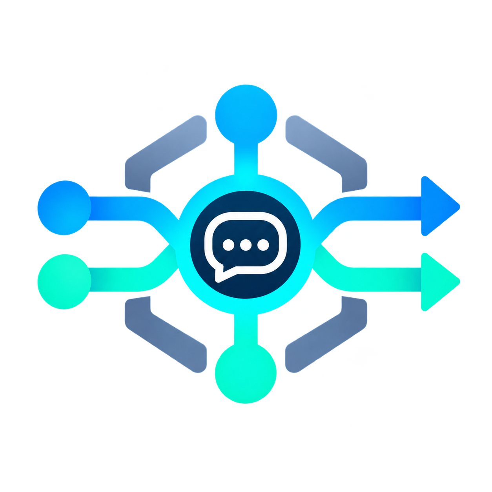
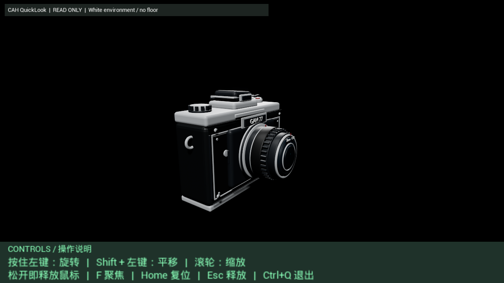

<p align="center"></p>

# Chat Agent Harness (CAH)

**Harness AI with Git.**

Chat Agent Harness is a Git-backed harness for turning ordinary ChatGPT conversations into persistent, tool-using agents that can plan work, execute tasks on a real machine, survive conversation replacement, and continue from durable state.

The basic idea is simple:

```text
ChatGPT  <->  Git  <->  Local Machine
```

ChatGPT handles semantic reasoning. Git holds durable state and coordinates work. Local runners and browser automation connect that state to real programs.

CAH builds the lifecycle, scheduling, recovery, and execution machinery around that connection.

---

## How CAH started

CAH started from a fairly simple technical question.

ChatGPT can already communicate with Git through official integrations and GitHub connectors. Git, in turn, is already a mature part of traditional software development and can reliably trigger or coordinate local programs.

So the question became:

**If GPT ↔ Git works, and Git ↔ local execution works, does GPT ↔ Git ↔ local execution work too?**

The remaining problem was simply how Git should reach a real machine.

The answer turned out to be surprisingly ordinary: **GitHub Actions and a self-hosted Runner already provide a mature solution for that.**

That small experiment worked.

The rest of CAH grew from there.

---

## What CAH does

A normal ChatGPT conversation is temporary. It may become too long, stall, be replaced, or simply be the wrong place to keep machine state.

CAH separates **reasoning context** from **durable task state**.

**Git is canonical.** ChatGPT conversations act as replaceable semantic workers around that state.

A managed task is typically divided into four roles:

```text
                         User
                          |
                          v
                     Foreground
                          |
                          v
                       Planner
                    /           \
                   v             v
               Worker         Worker
                    \         /
                     \       /
                      Helper
              operational recovery
```

### Foreground

The persistent human-facing boundary. It interprets user intent, decides whether work is small enough to execute directly or should become managed work, and presents final results back to the user.

### Planner

Owns task-level reasoning. It decomposes larger work, dispatches bounded Child tasks, reviews Worker results, replans when necessary, and preserves semantic continuity across generations.

### Worker

Executes one bounded piece of work. Workers can use GitHub, browser automation, local programs, scripts, build systems, Blender, Unreal Engine, or other authorized execution surfaces.

Workers are replaceable. Their continuity lives in Git rather than in one conversation.

### Helper

Handles operational incidents. Helper is not another Planner: its job is to diagnose and repair problems such as a stalled browser conversation, blocked Runner, broken execution path, or other lifecycle fault without unnecessarily changing the task's semantic direction.

---

## Git is the source of truth

CAH deliberately does not treat chat text as authoritative machine state.

Important state is written to Git:

```text
Task Contract
Plan
Planner Memory
Worker Child Reply
Result / Outcome
Lane state
Lifecycle state
Evidence references
```

A model response is useful reasoning context. A durable Git write is the record that survives it.

Current semantic completion uses a durable result followed by a lightweight synchronization signal:

```text
semantic work
    |
    v
write Result / Outcome with turn_signal
    |
    v
semantic_sync
    |
    v
Harness verifies Git and advances the lifecycle
```

This allows a conversation to disappear without taking the task history with it.

---

## Execution paths

CAH currently has two main execution modes.

### Direct bounded work

Small, clear tasks can remain under Foreground ownership. They do not need a Planner/Worker task tree merely because local execution is involved.

A dedicated Short Task Runner can be used for bounded host-side work.

### Managed Task Cell

Larger tasks use the Planner → Worker model.

A managed task can:

- span multiple conversations;
- use multiple Worker lanes;
- hand work across Worker generations;
- preserve Planner continuity;
- continue while external builds, renders, Cooks, or workflows are running;
- recover from physical conversation failures;
- keep task state independent of browser conversation lifetime.

---

## Conversation lifecycle

CAH treats ChatGPT conversations as managed execution resources rather than permanent agents.

Current lifecycle mechanisms include:

- task-owned Worker pools;
- multiple Worker lanes;
- generation and fencing;
- durable handoff state;
- Planner continuity memory;
- Worker Child Reply continuity;
- bounded conversation retention;
- physical conversation replacement;
- watchdog-driven recovery;
- Helper recovery paths;
- deterministic cleanup of task-owned runtime state.

A Worker can therefore finish one generation, preserve its progress, and allow a successor to continue without relying on the previous chat remaining active forever.

---

## Browser and local execution

CAH uses an authenticated browser session as the semantic execution surface and connects it to local infrastructure.

The host side currently includes:

- a native Playwright-based browser host;
- a local Bridge;
- Git-backed control state;
- GitHub Actions;
- self-hosted Runners;
- registered reusable Tools;
- task-local scripts and execution materials.

CAH does not require every task to be implemented as a GitHub Actions workflow. Workflows, local scripts, browser Tools, and other execution providers are selected according to the task.

---

## Tools and Skills

CAH distinguishes reusable **execution capabilities** from reusable **semantic procedures**.

### Tools

Tools are executable capabilities: browser interaction, local command execution, capability probing, or task-specific providers. The Tool Registry defines reusable execution surfaces without embedding their implementation details repeatedly in role prompts.

### Skills

Skills are reusable semantic procedures learned or imported from successful work. A Skill can describe how to approach a recurring class of task while leaving actual execution to the relevant Tool or authorized environment.

The public source distribution intentionally starts without the maintainer's personal Skill collection.

---

## Public source vs. operational CAH

**This repository is a public source distribution. It is not intended to be the live state repository for real CAH work.**

A live CAH instance may accumulate task descriptions, planning state, project information, execution evidence, machine bindings, ChatGPT Project bindings, local configuration, and reusable Skills derived from private work.

For that reason, normal deployment uses a separate **private operational repository**.

```text
Public CAH source
        |
        v
Create / select a private operational repository
        |
        v
Generate installation-specific configuration
        |
        v
Bind browser, Projects and Runners
        |
        v
Run real CAH tasks
```

The installer should verify repository visibility from an authoritative GitHub source before enabling real task execution.

Do not use this public repository as the canonical store for private runtime state.

---

## Installation

The current public edition is designed for **AI-assisted installation** rather than blind path replacement.

Start here:

**[installation/README.md](installation/README.md)**

The installation package contains:

```text
installation/
├── README.md
├── CONFIGURATION_MAP.md
├── OMITTED_COMPONENTS.md
├── config.example.json
├── placeholders.json
├── configure.py
├── preflight.py
└── first_start.ps1
```

### Configuration is explicit

Machine-specific values are represented by placeholders rather than maintainer paths.

The installation map explains:

- what each removed private path or identifier originally did;
- which runtime component consumes it;
- what the installer should discover on the new machine;
- where the replacement value belongs;
- how to verify it.

Configuration classes include the CAH checkout, Bridge runtime, Managed and Short Task Runners, browser runtime, Chrome executable and profile, Playwright tools, work/temp directories, operational Git repository, Task Cell Project, Worker lane Projects, and Foreground conversation.

The installer generates a **new operational copy** rather than modifying the clean source tree in place.

```text
python installation/audit.py
python installation/configure.py --config <LOCAL_CONFIG_JSON> --output <NEW_OPERATIONAL_DIRECTORY>
```

---

## What is intentionally not included

The clean public source does **not** ship the maintainer's private runtime environment.

In particular, this edition excludes:

- personal Skills and imported Skill snapshots;
- private workflow and toolbox payloads;
- active tasks;
- Planner / Worker memory from real tasks;
- result and evidence history;
- conversation identifiers;
- real ChatGPT Project bindings;
- machine capability caches;
- local browser profiles;
- credentials or authentication material;
- private Git history;
- previous deployment-specific state;
- raw private showcase histories and unreviewed case payloads.

The underlying Skill, Tool, scheduler, browser, Planner, Worker, Helper, and execution architecture remains.

A missing workflow therefore means **WORKFLOW_NOT_PROVISIONED** — not that a private maintainer workflow should be copied from somewhere else.

---

## Showcases

CAH is intended to be demonstrated through complete end-to-end workloads rather than isolated synthetic commands.

### Viewer/Cook showcase — two parts

[Read the case study](showcases/ue-parallel-viewer/README.md) · [中文](showcases/ue-parallel-viewer/README.zh-CN.md) · [Evidence](showcases/ue-parallel-viewer/evidence.json)



**Part 1 is the success case:** one long-running managed task split into fresh Cook, fresh Viewer, and integration workstreams, then iterated for more than five hours until real native output passed the acceptance boundary.

**Part 2 is the recovery stress test:** after that successful baseline, heavier real-package/direct-preview work exposed two system-level failure classes — Worker-authored execution that could wedge shared Runner capacity, and a long-lived ChatGPT page that reached response-start but remained busy for more than two hours without producing semantic output. Backup capacity and several live recovery hotfixes got the task moving again after the first class; the second class became the explicit stop boundary at G32.

The Part-2 stop does not retroactively dilute the completed Part-1 result. Instead, it identifies CAH's current reliability frontier: recovery after strong external interference. Physical watchdog/retry behavior and the semantic Helper recovery role are being actively strengthened around that boundary.

More sanitized showcases can be added here as complete end-to-end records become suitable for public release.

---

## Current status

Current clean source tag:

```text
clean-2026-09-29
```

The previous public source tree is preserved at:

```text
archive/pre-clean-20260929
```

The six obsolete test expectations found during migration were reviewed and retired as outdated test contracts rather than carried forward as current runtime defects.

### Publication validation

Current applicable validation includes:

- **306** offline tests;
- **0 failures**;
- **0 errors**;
- Linux publication run: **296 passed / 10 environment or packaging skips**;
- Windows installation/startup checks: **18 / 18 passed**;
- PowerShell parser: **10 / 10 scripts, 0 errors**;
- privacy/integrity scan: **PASS**;
- relative Markdown link check: **PASS**.

See [audit/PUBLICATION.json](audit/PUBLICATION.json), [audit/verification.json](audit/verification.json), and [audit/TEST_CONTRACT_CLEANUP.md](audit/TEST_CONTRACT_CLEANUP.md).

This does **not** claim independent third-party security certification, universal compatibility with every machine, or fresh-machine acceptance on arbitrary hardware.

The existing development deployment has also completed real Viewer and Cook workloads, but those operational cases are not presented as a substitute for independent installation testing.

---

## Repository layout

```text
AGENTS.md
installation/
docs/
    task-cell/
harness/
local_bridge/
playwright_host/
host/
executors/
skills/
state/
tests/
tools/
```

Important entry points:

- [installation/README.md](installation/README.md) — deployment and configuration
- [AGENTS.md](AGENTS.md) — common Agent contract
- [docs/task-cell/README.md](docs/task-cell/README.md) — managed role model
- [docs/task-cell/PLANNER.md](docs/task-cell/PLANNER.md) — Planner contract
- [docs/task-cell/WORKER.md](docs/task-cell/WORKER.md) — Worker contract
- [docs/task-cell/HELPER.md](docs/task-cell/HELPER.md) — Helper contract
- [docs/SCHEDULER_MODEL.md](docs/SCHEDULER_MODEL.md) — scheduling model
- [docs/CONVERSATION_POOL.md](docs/CONVERSATION_POOL.md) — conversation ownership and retention
- [docs/TOOL_SYSTEM.md](docs/TOOL_SYSTEM.md) — reusable executable capabilities
- [docs/SKILL_SYSTEM.md](docs/SKILL_SYSTEM.md) — reusable semantic procedures
- [docs/STORAGE_POLICY.md](docs/STORAGE_POLICY.md) — runtime/task storage policy

---

## Design principles

**Git is canonical.** Conversation state alone is not durable authority.

**Conversations are replaceable.** Continuity must survive a chat being retired or replaced.

**Semantic and mechanical work are separate.** Planner/Worker reasoning should not own transport bookkeeping that the Harness can determine mechanically.

**Execution should be task-shaped.** A browser Tool, local script, Runner job, workflow, or dedicated application may all be valid execution surfaces.

**Recovery should preserve semantics when possible.** A physical failure should not automatically create a new semantic direction.

**Private runtime state stays private.** The public source repository is not a live CAH task database.

---

## Requirements

The current maintained reference environment is Windows-based.

A typical installation uses:

- Git;
- Python 3.10+;
- PowerShell;
- Node.js for Playwright tooling;
- Chrome or a compatible configured browser;
- GitHub access;
- GitHub Actions self-hosted Runner(s);
- an authenticated ChatGPT browser session.

Professional applications such as Blender or Unreal Engine are **not** bundled or automatically selected by CAH. They are installed and authorized according to the user's actual task requirements.

---

## License

Chat Agent Harness is released under the **MIT License**.

See [LICENSE](LICENSE) and [NOTICE](NOTICE).

Third-party applications, services, models, and platforms remain subject to their own terms and licenses.

---

## Project stage

CAH is an experimental but working system.

It has moved beyond the original GPT ↔ Git ↔ local execution experiment into a persistent multi-role harness with real task execution, lifecycle management, recovery, and reusable capability infrastructure.

There is still substantial work ahead, particularly around portability, installation ergonomics, broader environment validation, and public examples.

For now, the repository should be read as:

**a working engineering project, not a finished universal agent platform.**
