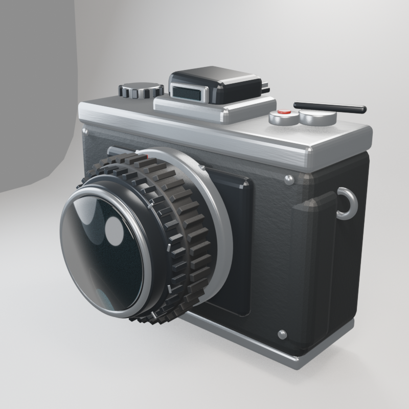
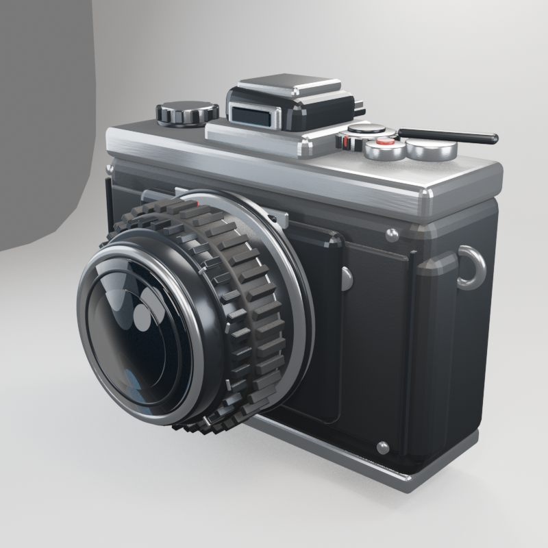
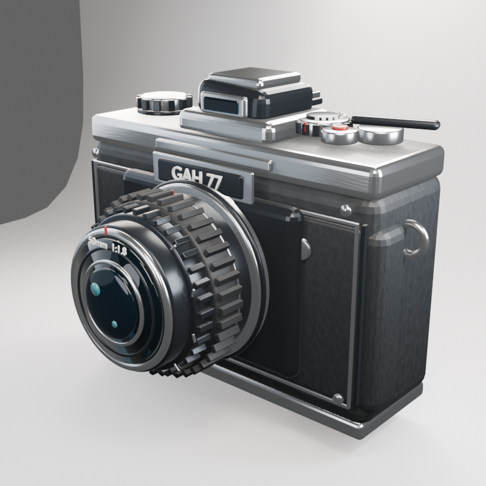
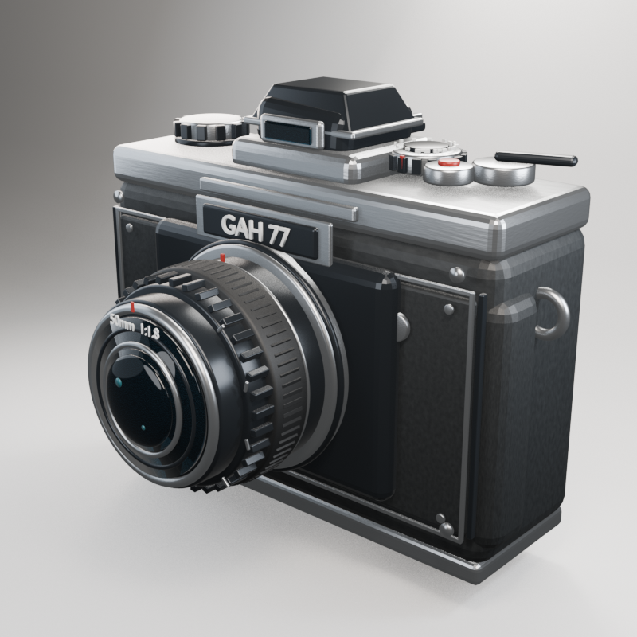
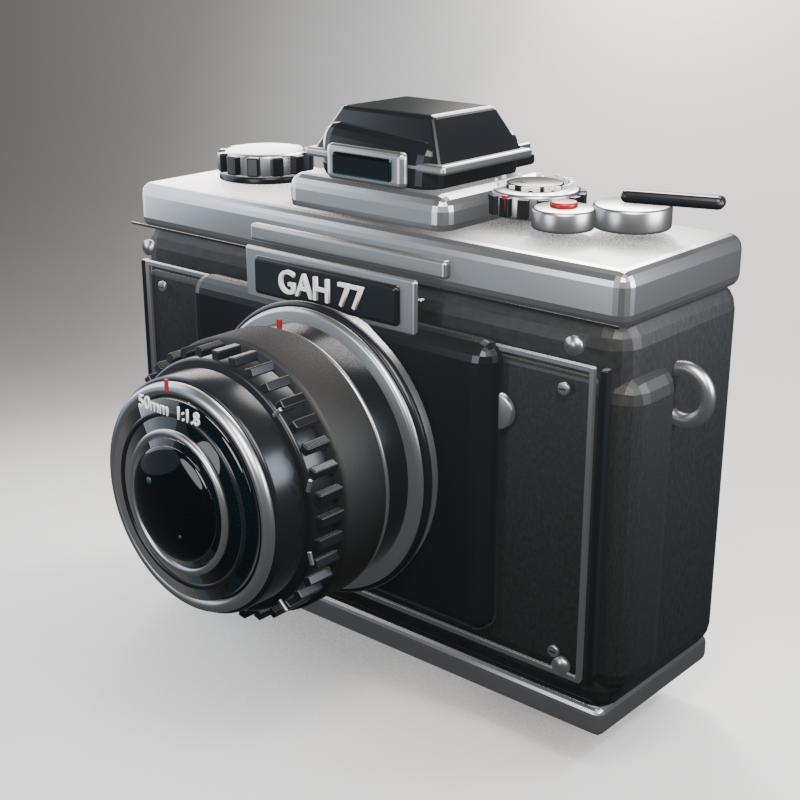

# Showcase: five iterations of a procedural retro camera

**A recorded single-lane application workload, not a fabricated illustration.** A managed reasoning Worker authored Blender Python scripts, a Windows runner executed them, rendered evidence returned for visual review, and the loop selected iteration 5.


The brief was a 1970s-style black-leather and silver mechanical camera with layered lens hardware, top controls, engraving and a studio presentation. The original GAH 77 badge predates the CAH rename and is retained in the artwork.

## Visual progression

| Iteration | Render | Main observed change |
|---|---|---|
| 1 |  | Recognizable basic body and optical stack; boxy proportions. |
| 2 |  | More hardware and body detail; lens still too dominant. |
| 3 |  | Better lens/body balance, optical depth and material separation. |
| 4 |  | Tapered prism roof, darker optics and cleaner studio sweep. |
| 5 |  | Conservative final polish of focus machining, controls and material response. |

The five quality iterations were completed in the recorded run. Initial execution needed repairs; iteration 2 needed a material-dependency repair. Visual attachment transport was improved during the task. A stalled semantic review also required foreground recovery. These interventions are part of the case, not hidden behind a claim of an entirely failure-free autonomous run.

## Download and reproduce

[Cleaned final Blender asset](final.blend) · [Final render](final.png) · [Public artifact hashes](evidence.json) · [Iteration scripts](scripts)

The individual later scripts load the preceding iteration's `.blend`; `iter_05.py` is **not** a standalone model generator. The wrapper creates the required output layout and executes all five scripts:

```powershell
py showcases/camera/reproduce.py --blender 'C:\path-to\blender.exe' --output camera-output
```

This requires Blender and can render many intermediate images. It runs the published procedural scripts directly; it does not reproduce the original model conversations or benchmark the whole agent loop. The recorded authoring run used Blender 5.2.0 LTS; rendering can vary across Blender versions and host settings.

The shipped `.blend` is a cleaned copy of the selected asset, not a newly invented replacement. No private chat screenshots, original host paths or unexecuted post-finalization variants are included. Public hashes describe the sanitized bytes.
