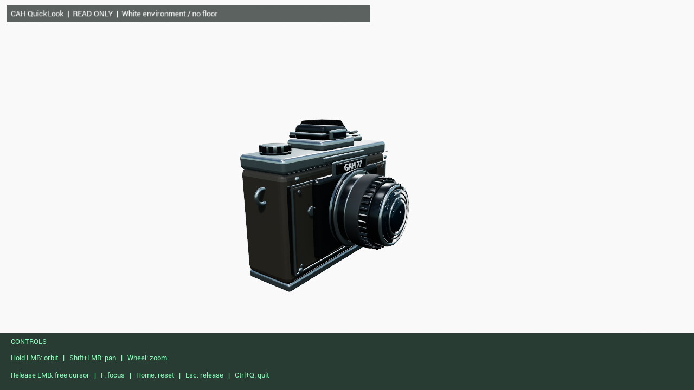
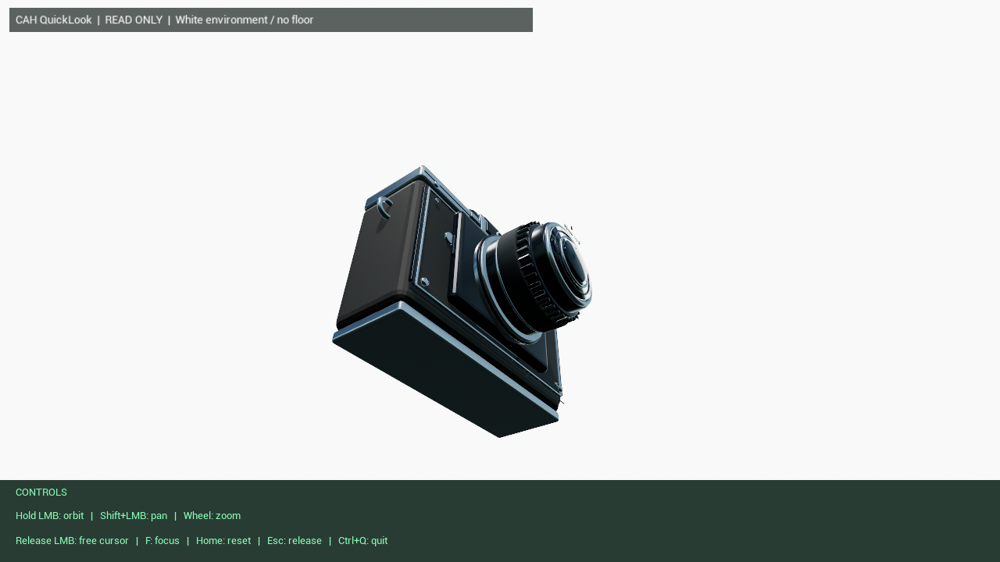

# Parallel test: Blender → Unreal Cook + native Viewer

[中文](README.zh-CN.md) · [Agent operation guide](AGENT_VIEWER.md) · [Evidence and timeline](evidence.json) · [Downloads](DOWNLOADS.md)

**One coordinated task, two complementary outputs:** convert an existing Blender camera into a cooked Unreal asset, and implement a native Viewer that can inspect it. The branches join only when the Viewer can open the real package and produce useful images. This case records a supervised CAH run on 20 September 2026, followed by user-driven usability fixes.

*Final native viewport, not an image-generation mock-up. The camera retains the historical “GAH 77” artwork from its original Blender case.*

## Task and starting point

The desired workflow was practical: make an asset in Blender, prepare its Unreal materials and Cook output, then inspect the result without opening the full Editor interface each time. The Viewer needed a human interface and an API for an agent to inspect the same native rendering, including screenshots in a silent mode.

The camera already existed from the [earlier Blender case](../camera/README.md). There was also a paused Viewer implementation and fixture-preparation code. This was a fresh **orchestration and acceptance run**, not a claim that both applications were invented from scratch during a short parallel interval. Existing source was reused, repaired, integrated and tested.

The acceptance target was a working local tool: real cooked model and materials, readable views, inspection of material slots and dependencies, useful camera controls, unchanged input-package hashes, and an entry point that opened the model. A blank window or an API returning `ok=true` alone was not sufficient.

## Why two Workers were useful

| Role | Work owned | Handoff |
|---|---|---|
| Foreground | Requirements, native-execution relay, visual review and user delivery | Confirmed task and final acceptance |
| Task Cell | Baseline decision, decomposition, bounded re-planning and result consumption | Decisions based on actual failures/results |
| Worker A — Viewer | Native Viewer source/preparation, launcher and integration scripts | Viewer ready to accept the package |
| Worker B — asset | Existing Blender camera → export → UE import/material setup → preview → Cook | Package manifest and real Cook output |

The two preparation branches had different outputs and could make useful progress independently. Their join was explicit: Worker A's integration work needed Worker B's actual package manifest, not an assumed filename. Before native readiness was established, one host check was enough; there was no reason to fan that check out.

The **single Windows runner serialized native jobs**. Two Worker conversations did not mean two simultaneous Unreal processes. The Foreground also ran the already-prepared Viewer validation while camera repair was being planned, rather than leaving the runner idle or repeating accepted work later.

## What the timing establishes

The underlying records use UTC. Worker start means runtime-observed response admission; end means the recorded source-preparation completion. The intervals below are not a token-level trace of model computation.

| Event | UTC, 20 September 2026 |
|---|---|
| Task Cell's initial plan recorded | 07:55:00 |
| Current native baseline accepted | 08:25:08.708 |
| Worker B: camera preparation | 08:34:49–08:36:47.129 |
| Worker A: Viewer preparation | 08:35:16–08:37:47 |
| Viewer native build/smoke | 08:47:25–08:48:45 |
| Successor Worker A: integration preparation | 08:55:50–08:59:00 |
| Successful camera preview/Cook resume | 10:10:16–10:11:31 |
| Readable native display accepted | 11:05:05.334 |
| Task Cell returned the task-level outcome | 11:11:00 |
| Final English UI/input check completed | 12:26:56.005 |

The two useful preparation intervals overlap by **91.129 seconds**. This demonstrates overlapping Worker activity with separate outputs, not a measured whole-task speedup. The longer chronology includes failures, human feedback and pauses. A controlled single-Worker comparison was not run. The [machine-readable timeline](evidence.json) retains the intermediate events and their meaning.

## Task Cell decisions that changed the run

**Re-check the repaired environment.** Old records said the compiler/toolchain was blocked. The current baseline instead reached real compilation and exposed a small C++ defect. Task Cell selected a bounded repair and a new native smoke check rather than repeating installation instructions.

**Repair a phase, not the whole workload.** Camera import initially failed because the script assumed a direct light-component attribute. The decision was to use component lookup and retain the exported FBX. The next attempt imported the asset successfully but requested a screenshot and quit before the asynchronous image was written. Task Cell then directed a preview-only resume, waiting for actual image completion before continuing Cook. Successful export/import was not repeated for appearance's sake.

**Join against reality.** The Viewer first needed a functioning Pak platform layer, package mount/catalogue handling and runtime shader-library support in its Editor-hosted `-game` configuration. Task Cell authorized a limited Viewer-side repair. An early mount/API pass still produced an unreadable dark scene and missing-shader warnings; those facts prevented visual acceptance. The final accepted display loaded the original material shaders and produced usable native captures.

These decisions preceded the relevant work. The Foreground still relayed execution requests and implemented/reviewed repairs. The case therefore demonstrates consequential task-level coordination, not autonomous end-to-end dispatch without supervision.

## Worker replacement without losing the task

A deliberately **synthetic** phase-boundary stall exercised the existing Worker turnover path. Worker A was replaced; Task Cell remained the same. The successor read the checkpoint, recognized that Viewer preparation and its native baseline were already complete, and prepared the remaining join instead of rebuilding them.

This was not an observed context-compaction failure. It verifies this specific handoff and reuse path, not every lifecycle, quota or recovery scenario.

## From a render to a usable inspection tool

User feedback changed the display after the first delivery. A pale floor improved readability but blocked low-angle inspection. It was removed in favor of an all-around light environment. The controls were subsequently returned to normal-size **English green text**, matching the final screenshots.

Mouse interaction changed from persistent capture to capture during a held drag. A native Windows input test observed capture while the button was held, no capture after mouse-up or Escape, movement outside the window, and a clean `Ctrl+Q` exit. Silent operation retained API access and native image capture without a visible Viewer window at readiness. Console-free VBS launch helpers were added separately; the recorded helper test invoked PowerShell directly, so it is not a continuous zero-flash recording of the VBS startup path.

The run also exposed ordinary engineering mistakes: an incomplete evidence-file list masked an earlier failure, concurrent updates to a shared branch interrupted result publication, and launcher edits briefly contained invalid newline escapes. Failed attempts remain in private history. The report does not convert them into a flawless demonstration.

## Result and reusable deliverable

The accepted cooked camera reported **9 material slots and 7 dependencies**. Six original integration captures covered front/perspective × lit/unlit/wireframe; later bottom and low-angle captures checked the floor-free design. The **150,124,353-byte PAK** retained the same SHA-256 through inspection and display/input updates. These are separate structural, visual and read-only checks, not interchangeable success signals.

The local Viewer includes a visible entry, a silent agent entry, a loopback `/v1` API and an [agent manual](AGENT_VIEWER.md) covering camera presets, selection, view modes and completed-file screenshot retrieval. It uses an installed **UE 5.6.1 Editor runtime in `-game`, DX11/SM5 mode**, not a standalone executable. The tested input is a classic PAK camera fixture; universal game/IoStore compatibility is not claimed.

See [Downloads](DOWNLOADS.md) for the Viewer package status and dependencies. **Unreal Engine itself is not bundled.** CAH's existing license files are unchanged; publication of the directly UE-linked Viewer module is awaiting a separate licensing decision.

## Evidence and privacy

[evidence.json](evidence.json) is a curated projection of executed records, with timestamps, role assignments, observed results and image/package hashes. Account and conversation identifiers, personal machine paths, raw host logs, private Git history and unpublished planning memos are omitted. Roles replace identities; concrete failures and decisions remain understandable. The PNGs are original viewport pixels with optional metadata removed, not retouched replacements.
