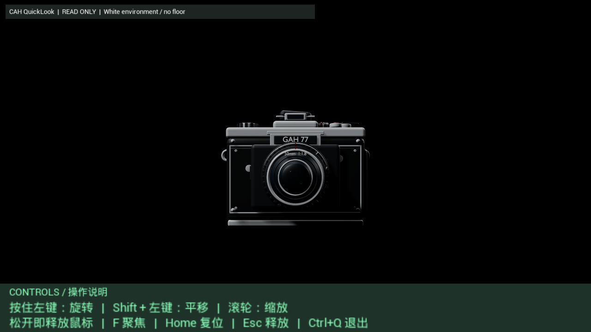
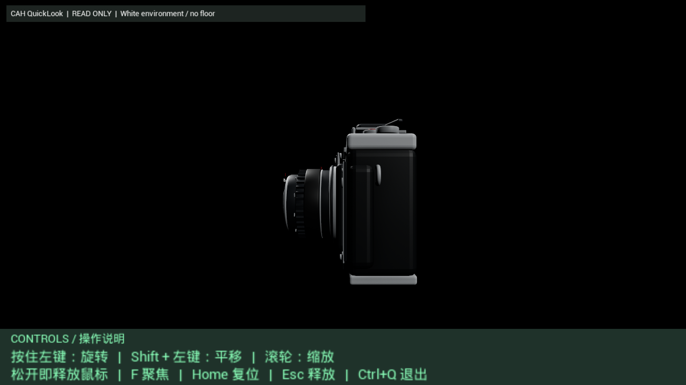
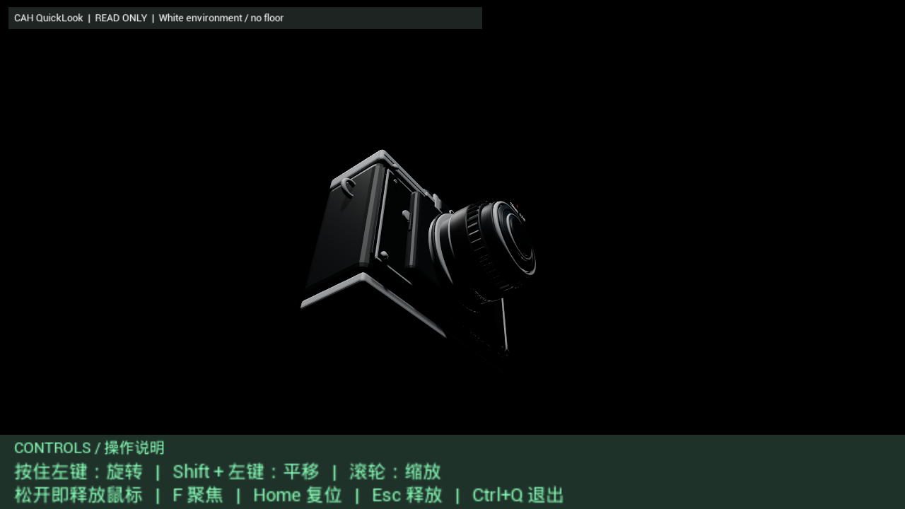

# Viewer／Cook Showcase：先是成功案例，再是后续问题发掘

[English](README.md) · [证据](evidence.json) · [重跑记录](records/2026-09-28-rerun-record.md) · [Viewer 客户端](viewer_client.py) · [操作说明](AGENT_VIEWER.md) · [下载与范围](DOWNLOADS.md)

这个 Showcase 最适合拆成 **两个独立 Part** 来看。

**Part 1 是一个完整成功案例。**  
一个持续数小时的 managed task，被拆成多条工作线推进，经历真实故障、反复 Worker 换代、执行与验收循环，最后以 Fresh Cook + Native Viewer 的真实结果正式通过。

**Part 2 是成功之后继续往更难问题推进的后续发掘案例。**  
在 Part 1 已经成功的基础上，继续把 Viewer 推向真实 package / direct-preview 问题，结果暴露出 provenance 误判、更深的 Unreal runtime 边界、执行 wrapper 故障、Runner 堵塞，以及 Helper 恢复机制本身的问题。部分侦察成功，后续实现最终主动停止。

所以，**P2 的未完成不应该反过来稀释 P1 的成功。**

---

# Part 1 — 长时间、多工作线、最终成功的完整案例

## 目标

从 fresh baseline 重新建立 camera Cook 和 Viewer 流程，并以 **真实 native Viewer 输出**作为最终验收依据，而不是只看 API 或进程是否成功。

Parent Task 在 **2026-09-28 11:25:48 JST** 正式进入 canonical 状态。

Planner 第一轮就把任务拆成两条可以独立推进的工作线：

| 工作线 | 目标 |
| --- | --- |
| Fresh camera Cook | 从真实 Blender 源重新建立 Unreal import/build/Cook 输出 |
| Fresh Viewer foundation | 独立重建 Viewer 基线，并准备后续联调所需的交互和检查能力 |

之后两条线再汇合到第三条联调线：

| 联调线 | 目标 |
| --- | --- |
| Exact Cook → Fresh Viewer | 用真实 Cook 输出打开目标模型/材质，完成可用 native 视图、交互与最终视觉验收 |

所以这不是“一个模型回合执行一个命令”，而是一个持续很久的 managed task：**多条任务线并行／交替推进，最终在明确 join condition 上汇合。**

## 和历史 Viewer 的实现路径有什么不同

P1 不是把旧 Viewer 二进制或旧工程目录复制过来重新跑一遍。

这一点在原始 Phase-1B Child contract 里被明确写死：

> historical GAHQuickLook 只能作为 source / design reference；旧 binary、旧 capture、旧 Cook output 和旧 PASS label 都不能作为本轮结果。

所以 P1 的做法是 **fresh reconstruction**：

- 新建这一轮独立的 Viewer source/build tree；
- 重新针对当前安装的 UE 5.6.1 build；
- 历史 Viewer 只保留值得复用的设计概念，例如 package group resolution、mount/catalog/preview 分层、loopback API、native viewport，以及 shader/dependency failure reporting；
- 重新实现并实际验证本轮要求的交互状态机：按住拖动 orbit、Shift+拖动 pan、mouse-up 立即释放 capture、Esc 强制释放、wheel zoom，以及 idle 时鼠标可以正常离开 Viewer；
- 重新建立适合检查模型的 floor-free scene 和 lighting/exposure 默认值；
- 最终必须接入这一轮 **fresh Cook**，不能拿历史 camera placeholder、历史 package 或历史 Viewer PASS 顶替。

更关键的是，P1C 后续证明“照搬旧加载路径”本身也走不通。

旧式 dynamic loader 在真实 fresh Cook 上首先遇到 Pak mount delegate / package discovery 边界；随后“把旧式容器直接塞进 Content/Paks 再启动”的思路也被实际运行否定。Worker 因此继续重构 runtime 路线，最终把 Viewer 自身调整成 **Pak-only / no-IoStore** 的 fresh packaged runtime，并从真实外部 camera PAK 打开对应 shader library，再完成 native capture 和 interaction acceptance。

所以更准确地说：

```text
历史 Viewer
    ↓
只提供 source / UI / API / architecture reference
    ↓
重新建立 fresh source/build tree
    ↓
重新实现本轮交互与 inspection defaults
    ↓
重新 build / smoke
    ↓
用本轮 fresh Cook 做真实 integration
    ↓
旧加载路线不成立 → runtime 路线继续重构
    ↓
Pak-only fresh Viewer + real external PAK
    ↓
native pixel + interaction acceptance
```

它不是“从零发明所有概念”，因为历史版本确实提供了设计参考；但 **通过验收的 P1 Viewer 不是旧 Viewer 的二进制复用、旧结果重放，也不是简单复制工程后重新编译，而是一条重新构建、重新集成、并在失败中改变 runtime 实现路径的 fresh reconstruction。**

## 过程并不顺

Fresh Cook 首先遇到了 Windows 路径长度问题。

系统没有把已经接受的 Blender 源丢掉，也没有整套重来，只把任务自有 UE 工作目录迁到更短的位置，然后继续。

Viewer 这边更典型：机械成功早于视觉成功。

当时已经能做到：

- package 打开；
- API 返回成功；
- 目标 asset 被发现；
- native capture 被请求；

但真实 Lit 画面仍然太暗，无法作为可用 Viewer 验收结果。

这个结果被**直接拒绝**，而不是因为“接口绿了”就宣布成功。

之后继续限定范围地排查：

- stage/background；
- shader-library 行为；
- packaged runtime；
- platform-file routing；
- runtime shader discovery。

多条看起来合理的解释都被真实证据推翻。

真正的循环是：

```text
执行
→ 看真实结果
→ 拒绝假成功
→ 缩小问题范围
→ 修复
→ 再执行
→ 再验收
```

## 成功边界

Phase 1 在 **16:27:18 JST** 正式通过。

从 Parent 开始到最终验收共：

**5 小时 1 分 30 秒**

最终验收包括：

- 从 accepted source fresh 重建出的 Cook；
- external camera PAK 字节保持不变；
- package 成功打开；
- preview 成功加载；
- 目标 camera mesh 正确选中；
- source shader library 正确打开；
- interaction acceptance 通过；
- 4 张 native Lit 视图经过真实像素检查后通过。

外部 camera PAK 保持同一 SHA-256：

```text
e0486f3cbab4048ce7d76260d1e42f2d34177e64152f4c70dd7877825e191305
```

4 张 native capture 的精确大小与 SHA-256 记录在 [evidence.json](evidence.json)。

### P1 实际验收截图

下面四张就是 2026-09-28 rerun 中由 Planner 接受的实际 native Lit 截图，不是旧图替代品，也不是生成图。

**Perspective**


**Front**



**Right**



**Below**



上面展示的就是 [evidence.json](evidence.json) 里记录 byte size 和 SHA-256 的那四个原始文件。

一个视觉限制也原样保留：最终验收时背景是黑色，不是白色。模型本身清晰可读、below 视角无遮挡，因此 Phase 1 的实际验收条件满足。公开案例没有为了更漂亮而重写事实。

## 为什么 Part 1 可以单独成为成功 Showcase

Part 1 已经构成一个完整闭环：

```text
一次完整任务输入
    |
    +-- 工作线 A：Fresh Cook
    |
    +-- 工作线 B：Fresh Viewer
    |
    +-- 联调线：Exact Cook → Viewer
              |
              +-- 多轮诊断／修复
              |
              v
         实际结果通过验收
```

用户不需要在每一个 bounded failure 后重新手工输入“继续”。

已经验收的工作被保留；失败假设转化成下一轮决策的证据；整个 Parent Task 始终围绕原始 acceptance criteria 推进，直到 native Viewer 真正通过。

**Part 1 到这里结束。它本身就是一个成功案例。**

---

# Part 2 — 强外部干扰下的 Recovery 压力测试

Part 2 是在 Part 1 已经正式成功之后才开始的。

它最有价值的结果并不是“又多完成了一个 Viewer 功能”，而是把系统推到了另一个问题上：

> **当 Worker 在正常任务执行过程中，自己生成了足以堵死执行系统的错误代码；或者网页执行面本身长时间运行后失去响应时，CAH 能不能把任务救回来？**

Part 1 已经证明：当失败仍然局限在正常任务和 replanning 范围内时，CAH 可以连续数小时、多工作线稳定推进并最终验收。

Part 2 则开始撞上 **系统级 recovery failure**。

## Part 2A — 普通技术调查仍然运转良好

Part 2A 仍然属于正常 evidence-driven engineering。

combined provider 最初可以导出目标逻辑路径，但 provenance 检查后来证明，默认 same-path 选择命中了 base-game PatchPak，而不是已经证明目标 MOD 来源。

后续 archive-specific loading 直接证明指定 package member 内存在真实 `USkeletalMesh`：

- **25 个 material slots**
- **26 个 morph targets**
- **1 个 LOD**

Part 2A 在 **18:47:16 JST** 正式通过，距离 Parent 开始 **7 小时 21 分 28 秒**。

这一阶段仍然和 P1 类似：假设可以错，Worker 可以换代，只要错误没有摧毁执行基础设施，任务就能继续。

## 先看稳定性数字：这不是 Dry Run

在讲 G9 之前，先把最重要的前提说清楚：

**这不是 soak test、dry run，也不是为了测稳定性专门写出来的假任务。**

用户给下去的是一个具体工程任务，CAH 实际在做：

- Blender / UE 资产链；
- Fresh Cook；
- Fresh Viewer 重构；
- native Viewer 验收；
- Build / Cook；
- package / runtime 调查；
- 后续 direct-preview 研究。

也就是说，下面的时间不是“网页开着没死多久”，而是**一个真实工程任务在持续产生有效工作多久**。

Parent Task 从 **2026-09-28 11:25:48 JST** 开始。

直到 G9 在 **21:24:07 JST** 第一次制造系统级外部堵塞之前，没有记录到人工运维介入。

这一段连续运行时间是：

# **9 小时 58 分 19 秒**

期间当然有普通工程失败、错误假设和 Worker 换代，但这些都由 Planner / Worker 正常循环自行吸收，不需要人去修 CAH 本身。

这意味着：

> **在没有系统级强干扰的情况下，这个真实任务第一次需要人工碰 Harness，已经接近连续运行 10 小时之后。**

## G9 — 第一次把 Recovery 薄弱点打出来

Recovery 故事真正从 G9 开始。

**21:19:20 JST**，G9 到达 Worker response-start；**21:24:07** 启动外部 staged runtime operation；**21:25:42** Worker 自己已经完成 durable handoff。

但 Worker 生成的 task-local execution wrapper 有一个系统级危险：同步嵌套 Viewer launcher，却没有外层 watchdog / timeout 和可靠 cleanup。

于是外部 run 从：

**21:24:07 → 22:24:45，共 1 小时 00 分 38 秒**

持续占住主 Runner。

这第一次证明：问题已经不只是“某个实验失败”，而是 **Worker 自己写出的执行代码可以反过来堵住 CAH 的共享执行能力**。

G10 在 **21:26:37** 已经 dispatch，却直到 **22:13:13** 才 response-start，中间有 **46 分 36 秒** 的 admission / transport 延迟。

## 第一次人工干预 — 大约在 G10 周期完成

G9 事故之后，系统在 G10 左右经历了第一次人工运维 / Harness hotfix。

这次干预不是只处理一个 Viewer bug，而是在恢复基础设施层补东西，包括后续真正发挥作用的：

- backup Runner / 冗余执行能力；
- semantic-sync / durable result 收敛；
- Worker retention / binding 修复；
- Host / lifecycle 相关补丁。

G10 自己最终也继续完成了语义工作：

- **22:58:18** durable result；
- **23:18:11** 已经 durable 的结果被新的 semantic-sync 路径正确 canonical finalize；
- 随后的 G11 retention/binding delay 也被修复，同一个语义任务继续，没有重开 Parent Task。

因此第一次干预的价值，要到后面的 G12 才真正被压力验证。

## G12 — 再次出问题，但第一次干预开始真正救系统

G12 的 corrected hybrid-mode experiment 在 **00:21:01 JST** 启动，又出现一次约一小时的外部堵塞：

**00:21:01 → 01:21:40，共 1 小时 00 分 39 秒**

如果系统还是 G9 时的状态，这里很容易再次把整个 Task Cell 一起拖死。

但第一次干预已经加入了 backup capacity。

于是主 Runner 仍然被 G12 占住时，后续三代 Worker 仍然继续：

- **G13：00:26:13 → 00:31:45**
- **G14：00:32:43 → 00:39:25**
- **G15：00:40:41 → 00:45:43**

这才是第一次 hotfix 最直接的成功证据：

> **G12 又把主执行资源堵住了，但系统没有像 G9 那样整体失去推进能力；G13–G15 仍然连续工作，把状态推进到 Planner review。**

也就是说，第一次干预没有“解决所有 recovery”，但已经把系统从：

```text
一个 Runner 被堵
→ Parent Task 基本停摆
```

推进到了：

```text
一个 Runner 被堵
→ backup capacity 承接后续 Worker
→ semantic frontier 继续向前
```

## 两次人工干预后的整体运行时长

把整个 Parent Task 放在一起看，稳定性更直观。

从最初 Parent Task 开始：

**2026-09-28 11:25:48 JST**

到 G31 正常写出 durable handoff：

**2026-09-29 05:13:44 JST**

同一个具体任务累计持续运行：

# **17 小时 47 分 56 秒**

这将近 18 小时里，真正需要人工去修 CAH recovery / infrastructure 的只有 **两次**：

1. G9 事故后的第一次 recovery infrastructure hotfix；
2. G15 之后 Helper recovery 无法闭环时的 Hotfix 2.0。

而 Hotfix 2.0 完成后，从原 Planner 在 **02:00:32** 恢复，到 G31 在 **05:13:44** 正常 handoff，又连续运行了：

# **3 小时 13 分 12 秒**

期间没有再记录新的 Helper failure，也没有第三次人工 recovery 干预。

最终 G32 页面物理卡死，把 Parent Task 的 wall-clock 生命周期延长到 **07:41:16 JST**，也就是从最初启动算：

**20 小时 15 分 28 秒**

但最后 G32 response-start 后的 **2 小时 26 分 05 秒** 是网页 busy / no-output 的死时间，所以不应该拿来冒充有效 uptime。

因此更诚实、也更有意义的稳定性数字是：

```text
首次需要人工运维修复：
9h58m19s

到 G31 的有效任务连续生命周期：
17h47m56s

期间人工 recovery 干预：
2 次

Hotfix 2.0 后再次无人运维干预连续运行：
3h13m12s
```

这就是这个 Showcase 最值得强调的地方之一：

> **不是一个专门为稳定性测试设计的 Dry Run，而是一个真实复杂任务下去之后，系统自己连续工作了接近 10 小时才第一次需要人工修 Harness；经过两次现场修复后，同一个任务仍然继续推进到接近 18 小时的有效生命周期。**

## G15 之后 — 真正卡住的是 Helper recovery，而不是 G15 Worker

G15 本身并没有卡死。

它在 **00:45:43** 正常写出 durable result。

随后：

- Planner 在 **00:47:30** response-start；
- **00:50:48** 写入 `WAIT_HELPER`；
- Helper request 在 **00:51:07** staged；
- Helper 在 **00:51:26** response-start。

问题出现在这里。

第一版 Helper 能诊断 G12 遗留的 operational incident，但仍然偏“看问题”，不能完整完成：

```text
必要 mutation
→ 精确清理
→ durable incident/result
→ canonical closure
→ return control
```

因此真正触发 **Hotfix 2.0** 的，不是 G15 Worker 自己，而是 **G15 之后的 Helper recovery 段无法闭环**。

## 第二次人工干预 / Hotfix 2.0 — 把 Helper 补成真正的 Recovery Owner

第二次人工干预直接修改了 Helper 的职能边界。

Helper 从“事故诊断者”被强化成可以：

- 根据 Planner 授权执行 bounded recovery mutation；
- 精确取消 / 清理属于该 incident 的外部执行；
- 验证 Runner 清场；
- 写入 durable incident/result；
- 完成 canonical closure；
- 把控制权明确交还给 Planner。

恢复后的同一个 Helper incident 随后真正完成：

- Helper result：**01:54:32**
- canonical Helper completion：**01:59:54**
- `helper_result` enqueue：**02:00:04**
- 原 Planner 再次 response-start：**02:00:32**
- Planner durable done：**02:02:47**
- **G16 response-start：02:04:22**

之后 G16、G17、G18、G19 继续自动滚动。

这里才是 Helper Hotfix 2.0 的直接成功证明。

## Hotfix 2.0 之后，Helper 本身没有再出现新的故障

在这次 run 后续记录里，**没有再出现第二次 Helper failure**。

更准确地说：

- Hotfix 2.0 后，当前这个 Helper incident 被成功闭环；
- 控制权顺利回到原 Planner；
- 后续 Worker generation 正常继续；
- 到 G32 之前没有再记录新的 `WAIT_HELPER` / Helper failure。

所以不能说“G20 又验证了一次 Helper”。

G20 只是 Hotfix 2.0 之后正常主路径中的一个漂亮样本：Worker、外部 Build/Cook、durable handoff、canonical finalize 和 Planner review 都正常工作。

它说明系统恢复后确实重新进入了健康运行，但 **G20 本身没有启动 Helper**。

整个因果链更准确地是：

```text
G9 出问题
→ 第一次人工干预 / recovery infrastructure hotfix

G12 再出问题
→ 第一次干预开始发挥作用
→ backup capacity 让 G13 / G14 / G15 继续

G15 正常完成
→ Planner 进入 Helper recovery
→ 第一版 Helper 无法闭环
→ 第二次人工干预 / Helper Hotfix 2.0
→ Helper 成功完成 recovery
→ Planner 恢复
→ G16+ 正常继续

G32
→ 暴露另一类 physical web-conversation failure
→ 不是 Helper 自身再次失败
```

## G32 — 第二种 Recovery Failure：网页本身长时间运行后不再产出结果

后面又撞上了另一类完全不同的问题。

G32 在 **2026-09-29 05:14:51 JST** 被请求。

**05:15:11**，运行时已经观察到 exact response-start / ACK。

也就是说，从 CAH 的视角看，这个 Worker 已经“开始响应”。

但这次没有像 G9 那样出现一个还在运行的外部任务。

真正卡住的是 **ChatGPT 的物理网页对话本身**。

在 **07:36:47 JST** 对 exact G32 页面做直接检查时——距离 response-start 已经超过 **2 小时 21 分**——观察到：

- exact G32 页面仍然存在；
- **assistant message 数量 = 0**；
- 页面仍显示 **Stop** 控件，表现为仍在 busy / running；
- Worker Reply 仍为空；
- Result 仍为空。

到 **07:41:16 JST**，canonical backend 仍然是 `RUNNING`。

因此 G32 暴露的是第二种 recovery failure：

```text
G9：
Worker 写错执行代码
→ 外部执行 / Runner 被堵死

G32：
单个 ChatGPT 网页运行过久
→ 页面一直 busy / 无响应
→ response-start 已存在
→ 但永远没有可消费的 semantic output
```

这里之后用户明确停止了 P2-B。

这个 stop 没有丢掉已经验收的成果：P1 和 P2A 都继续保持 accepted。停止的是一个尚未解决的 recovery 边界。

## P2 真正证明了什么

所以 P2 不应该描述成：

“Viewer 做到 G32 还是没做完。”

更准确的是：

**P2 是一次 Recovery Stress Test。**

它发现了当前 CAH 至少两个很具体的恢复边界：

1. Worker 自己生成的外部执行可以反过来堵住共享执行基础设施；
2. ChatGPT 网页这个物理执行面本身，也可能在长时间运行后卡死在“已经 response-start、但没有 semantic output”的状态。

第一类问题在运行中已经通过 backup Runner、semantic-sync recovery、lifecycle 修复、Helper contract 加强等方式得到了一部分缓解。

第二类问题说明：**物理网页会话本身也必须被当成可丢弃、可重建的资源，而不能因为 response-start 已经发生就假设最终一定会有输出。**

## 当前正在加强的方向

这次 Showcase 直接推动了现在的 Recovery 工作。

当前正在继续调试和加强的包括：

- Worker / Planner physical conversation watchdog；
- physical failure 时做 **same-generation retry**，而不是错误地增加 semantic generation；
- 对死掉的页面做确定性的 stop / delete / reinject original wake；
- 更清晰地区分 semantic failure 和 transport / physical failure；
- 把 Helper 从“会诊断事故”继续强化成真正可以执行 bounded recovery mutation、完成 durable closure、再把控制权交还正确角色的 semantic recovery owner；
- 继续强化冗余执行资源，避免一个外部任务堵塞就冻结整个 Parent Task。

这些能力**还在调试和验证中**，不能把 P2 写成“现在已经全部解决”。

目前更准确的结论是：

> **P1 已经充分证明了：在没有 G9 这种系统级外部强干扰时，CAH 可以稳定地长时间、多工作线运行并完成实际验收。P2 暴露出的下一阶段核心问题，不是普通任务规划能力，而是系统在被外部强干扰、执行资源被堵塞、或者网页执行面自身失效之后的恢复力。**

这已经成为 CAH 当前最重要的工程方向之一。

## 终态

```text
Part 1 / Phase 1   ACCEPTED

Part 2A            ACCEPTED INVESTIGATION
Part 2B            STOPPED AT RECOVERY LIMIT
Part 2C            NOT REACHED
```

P2 的停止不削弱 P1 的成功结论。

它只是把下一条真正需要修的系统边界暴露出来了。

---

## 公开实物

公开仓库包含 Viewer 控制面的实际 Python 客户端：

[viewer_client.py](viewer_client.py)

以及修正后的 [Viewer 操作说明](AGENT_VIEWER.md)。

2026-09-28 的 4 张 Phase-1 native capture 在 [evidence.json](evidence.json) 中保留精确 byte size 和 SHA-256。

完整 UE-linked Viewer module 不随仓库公开；范围见 [下载与范围](DOWNLOADS.md)。

---

## 两个 Part 分别说明什么

### Part 1

> **CAH 能够让一个持续数小时、包含多条工作线的真实工程任务，经历多轮执行、验证和修复，最终到达真实 acceptance condition。**

### Part 2

> **在已经成功的 baseline 上继续往更难问题推进时，同一套 durable task 模型可以继续发现错误假设、runtime 边界和 Harness 自身的薄弱点，同时不抹掉已经验收的成功结果。**

Part 1 展示的是“把困难任务做成”。

Part 2 展示的是“成功之后继续往前推，开始看见下一层真正的问题”。
